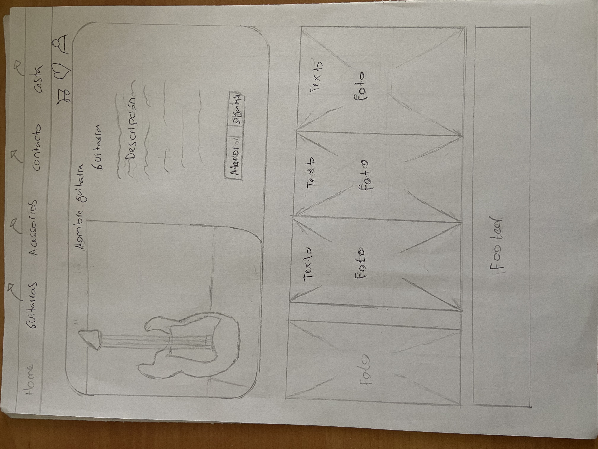
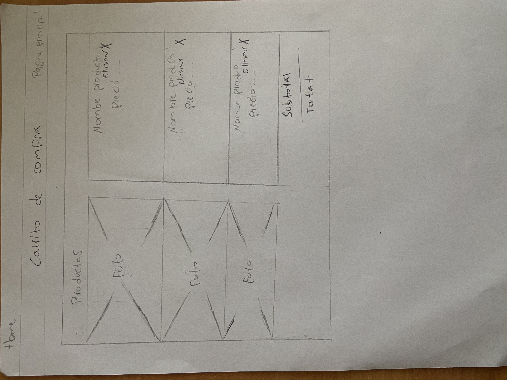
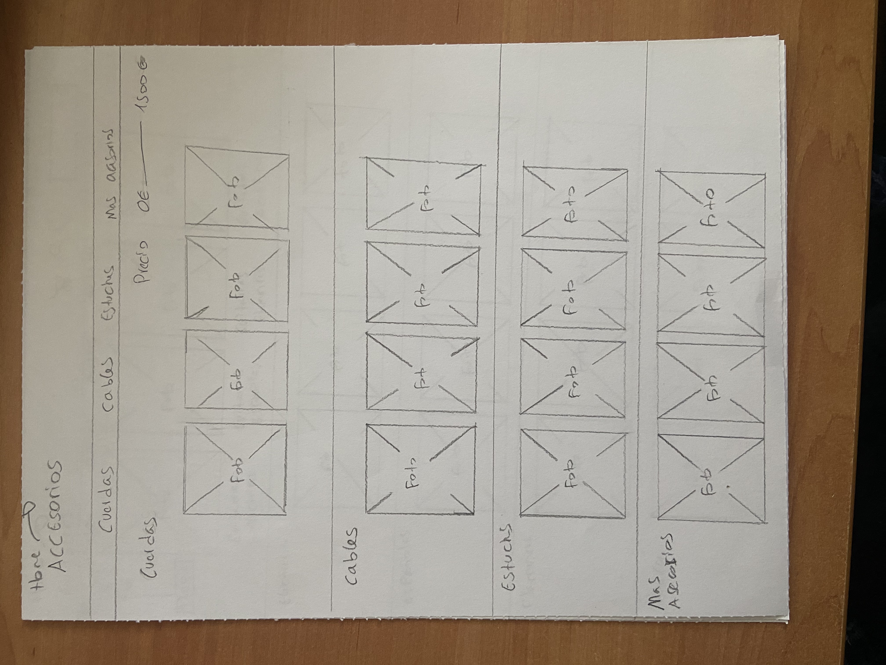
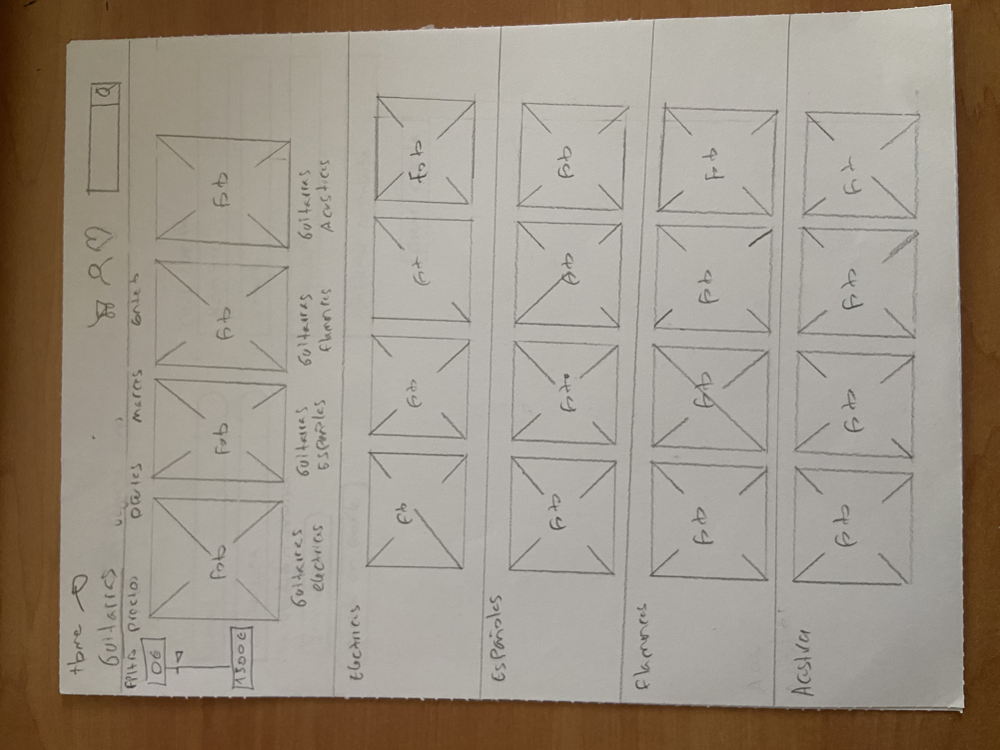
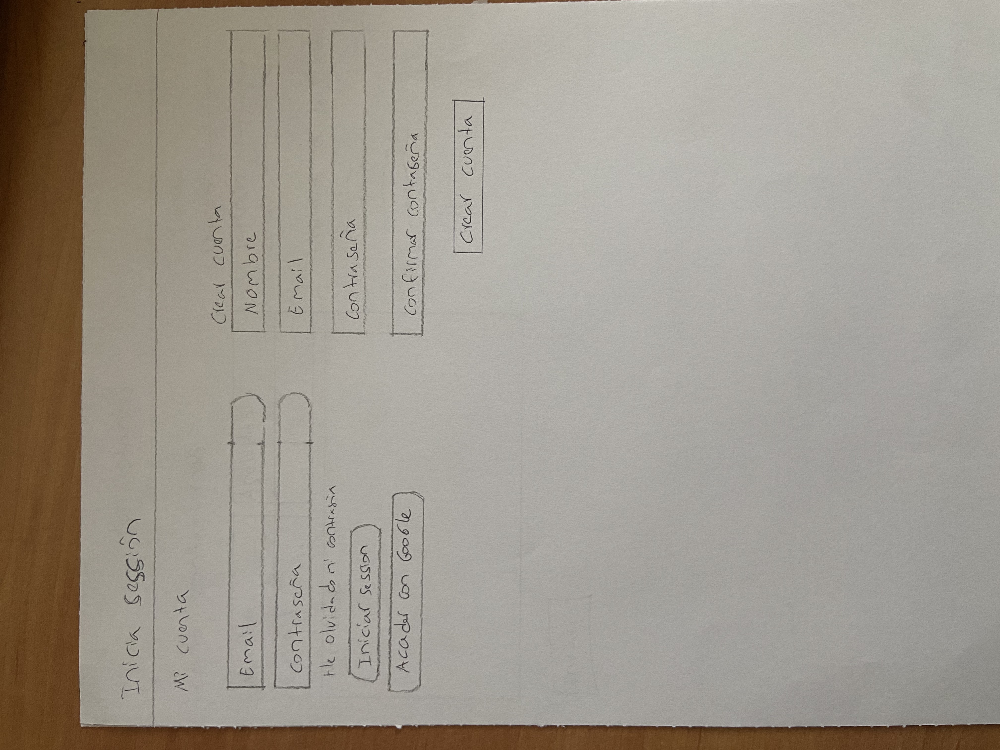
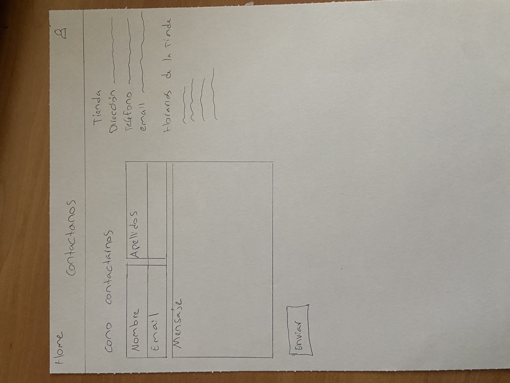

# P0_Wireframe

# Pagina principal

Esta es la página principal, he creado una pagina donde en el encabezado encontramos el home, las guitarras, Acesorios, Contacto y la cesta. Si hacemos click a una de ellas, nos llevara a la sección.
He puesto un dibujo de una personita, donde si el cliente hace click, le llevara a inicio de seccion o crear una cuenta.

Debajo he añadido una parte donde aparece una guitarra, al lado de ella aparecera la descripcion. Justamente debajo de la descripcion, habran dos votones, uno de ellos es para la siguiente guitarra y el otro es para volver a tras.

A continuacion a ello, apareceran fotos sobre guitarras , acessorios, fundas etc..

Al final de la pagina web, se encontrara el footer.

## Carrito de Compra

El carrito de compra es una sección donde se pueden agregar productos a la cesta o eliminar. 

He decidido que todos los productos aparezcan uno bajo el otro y al lado de ellos, aparecera su nombre y el precio. Tambien he añadido el subtotal y el total

## Acessorios

El accesoirios es una sección donde se pueden ver todos los productos de accesorios. En ellos encontraremos las cuerdad, cables, estuches y mas acessorios. 

Tambien, he añadido una filtracion donde pueden los clientes filtar las guitarras a partir del precio.

## Guitarras

La sección de guitarras es una de las mas importantes de la pagina web. En ella encontraremos todo tipo de guitarras, Españolas, Flamencas, Acusticas y electricas. Tambien los clientres podran añadir los filtros para poder hacerlo por precio.

He añadido un buscador donde se podra buscar el modelo de guitarra.

## Inicio Seccion.

En esta parte, econtraremos dos apartados, unos de ellos es iniciar seccion donde los clientes podran añadir su cuenta a travez de email y contraseña. 
Despues encontramos los que todavia no son clientes y ahi encontraremos un input donde se tendra que poner el nombre, email, contraseña y la confirmacion de contraseña.

## Contacto

Este punto encontraremos la opcion de como los clientes se pueden poner en contacto, hemos añadio la opcion que pongan el nombre, apellido , email y el mensaje . 

A su lado encontraremos la dirrecion de la tienda, el numero de telefono, email y tambien los horarios de la tienda.

